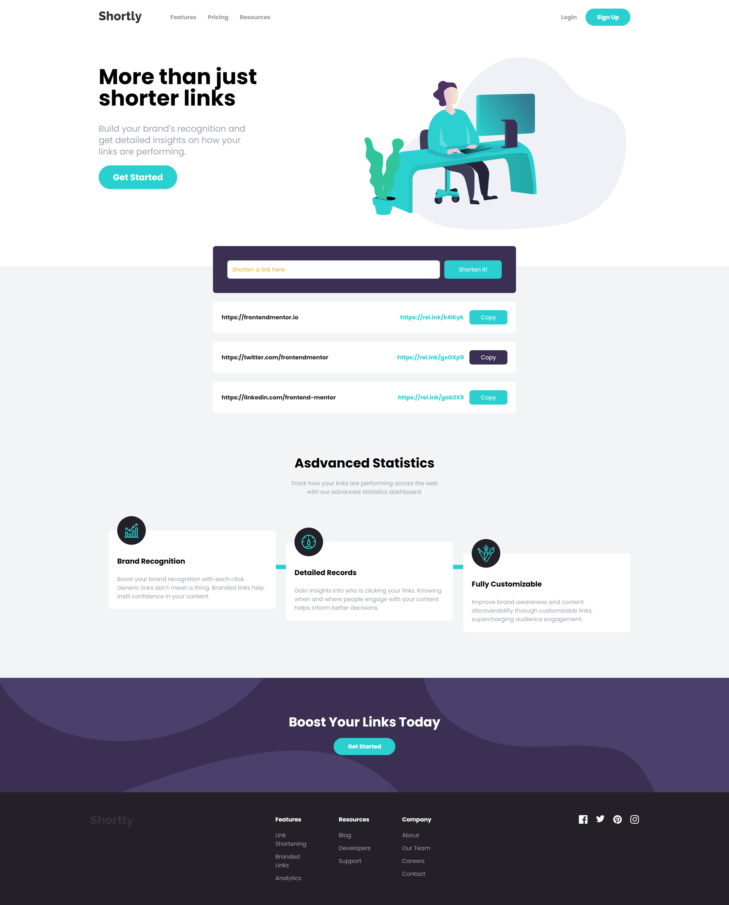

# FrontendMentor--URL-shortly-tailwind-css

URL shortening API landing page challenge using CSS framework - Tailwind CSS

URL shortening API landing page challenge from [Frontend Mentor Challenge](https://www.frontendmentor.io/challenges/url-shortening-api-landing-page-2ce3ob-G) using CSS framework - Tailwind CSS. Author of this whole page is Brad Traversy in his [Tailwind CSS From Scratch course](https://www.traversymedia.com/tailwind-css-course)

## Usage

Install dependencies

```
npm install
```

Run Tailwind CLI

```
npm run watch
```

### Screenshot




## My Contact

- Website - [Petr Bednarski](https://github.com/pettik)
- Frontend Mentor - [@pettik](https://www.frontendmentor.io/profile/pettik)
